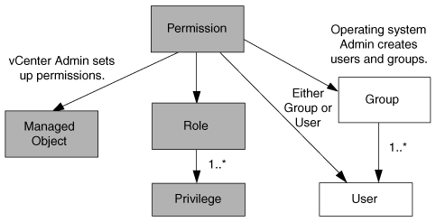

= vCenter Server 权限的组成部分
:allow-uri-read: 
:icons: font
:imagesdir: ../media/

[role="lead"]
vCenter Server 可识别权限，而不是权限。每个 vCenter Server 权限都包含三个组件。

vCenter Server 包含以下组件：

* 一个或多个权限（角色）
+
这些权限定义了用户可以执行的任务。

* vSphere 对象
+
对象是任务的目标。

* 用户或组
+
用户或组定义了谁可以执行此任务。

NOTE: 在此图中，灰色方框表示 vCenter Server 中的组件，白色方框表示运行 vCenter Server 的操作系统中的组件。

== Privileges

适用于 VMware vSphere 的 ONTAP 工具具有两种特权：

* 原生 vCenter Server 特权
+
这些特权随 vCenter Server 一起提供。

* ONTAP工具专用特权
+
这些特权是为适用于VMware vSphere的特定ONTAP工具任务定义的。它们是适用于VMware vSphere的ONTAP工具所特有的。

适用于VMware vSphere的ONTAP工具任务需要ONTAP工具专用特权和vCenter Server本机特权。这些权限构成用户的 "`role` " 。一个权限可以具有多个权限。这些特权适用于已登录到 vCenter Server 的用户。

NOTE: 为了简化vCenter Server RBAC的使用、适用于VMware vSphere的ONTAP工具提供了多个标准角色、这些角色包含执行适用于VMware vSphere的ONTAP工具任务所需的所有ONTAP工具专用特权和本机特权。

如果更改了某个权限中的权限，则与该权限关联的用户应先注销，然后再登录以启用更新后的权限。

== vSphere 对象

权限与 vSphere 对象关联，例如 vCenter Server ， ESXi 主机，虚拟机，数据存储库，数据中心， 和文件夹。您可以为任何 vSphere 对象分配权限。根据分配给 vSphere 对象的权限， vCenter Server 可确定谁可以对该对象执行哪些任务。对于适用于VMware vSphere的ONTAP工具的特定任务、只会在根文件夹级别(vCenter Server)分配和验证权限、而不会在任何其他实体上分配和验证权限。但VAAI插件操作除外、在该插件操作中、系统会对相关ESXi主机验证权限。

== 用户和组

您可以使用 Active Directory （或本地 vCenter Server 计算机）设置用户和用户组。然后、您可以使用vCenter Server权限为这些用户或组授予访问权限、使其能够对VMware vSphere任务执行特定的ONTAP工具。

NOTE: 这些vCenter Server权限适用于适用于VMware vSphere vCenter用户的ONTAP工具、而不适用于适用于VMware vSphere管理员的ONTAP工具。默认情况下、适用于VMware vSphere管理员的ONTAP工具对产品具有完全访问权限、不需要为其分配权限。

没有为用户和组分配角色。他们通过加入 vCenter Server 权限来获得某个角色的访问权限。
