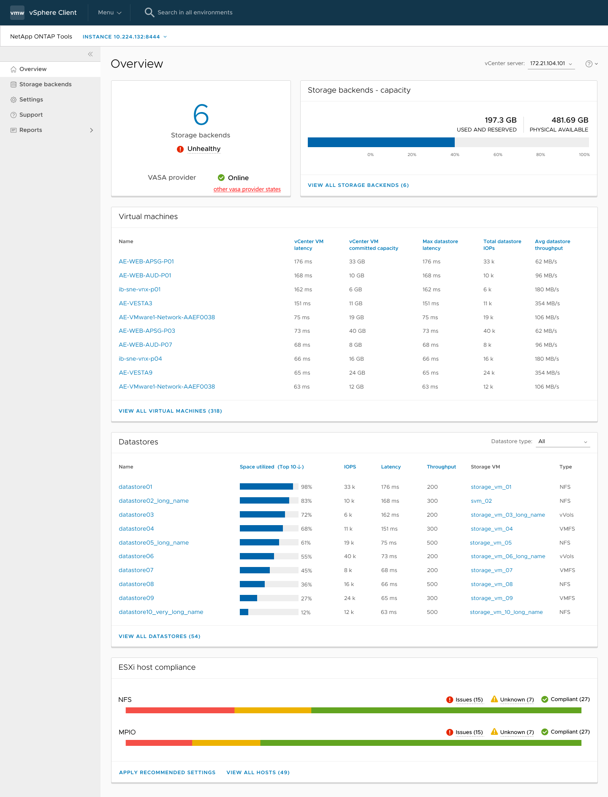

= 适用于VMware vSphere插件的NetApp ONTAP工具信息板概述
:allow-uri-read: 
:icons: font
:imagesdir: ../media/

[role="lead"]
在vCenter Client的快捷方式部分中选择适用于VMware vSphere的NetApp ONTAP工具插件图标后、用户界面将导航到概述页面。此页面类似于提供适用于VMware vSphere的ONTAP工具插件摘要的信息板。

对于增强型链接模式设置(ELM)、将显示vCenter Server选择下拉列表、您可以选择所需的vCenter Server以查看与其相关的数据。此下拉列表可用于此插件的所有其他列表视图。在一个页面中选择的vCenter Server会在插件的各个选项卡之间保持不变。

信息板包含多个卡片、用于显示系统的不同元素。下表显示了不同的卡及其所代表的内容。

|===

| *卡名* | * 问题描述 * 

| 状态 | 状态卡可显示添加的存储后端数量、存储后端的整体运行状况以及vCenter的VASA Provider状态。如果所有存储后端状态均正常、则存储后端状态将显示为"运行状况良好"。如果任一存储后端具有问题描述(未知/无法访问/已降级状态)、则存储后端状态将显示为"运行状况不正常"。单击"运行状况不正常"状态时、将打开一个工具提示、其中显示了存储后端的状态。您可以单击任何存储后端以了解更多详细信息。其他VASA Provider (VP)状态链接显示在vCenter Server中注册的VP的当前状态。 

| 存储后端—容量 | 此卡显示选定vCenter Server实例的所有存储后端的已用容量和可用容量。 

| 虚拟机 | 此卡显示按性能指标排序的前10个虚拟机。您可以单击标题以获取选定指标的前10个VM、这些VM按升序或降序排序。在更改或清除浏览器缓存之前、对卡所做的排序和筛选更改将一直存在。 

| 数据存储库 | 此卡显示按性能指标排序的前10个数据存储库。您可以单击标题以获取选定指标的前10个数据存储库、这些数据存储库按升序或降序排序。在更改或清除浏览器缓存之前、对卡所做的排序和筛选更改将一直存在。有一个数据存储库类型下拉列表可用于选择数据存储库的类型- NFS、VMFS或vols。 

| ESXi主机合规性卡 | 此卡按设置组/类别显示所有ESXi主机(对于选定vCenter)设置与建议的NetApp主机设置的整体合规状态。您可以单击应用建议设置链接来应用建议的设置。您可以单击Isses/Unknown以查看主机列表。 
|===